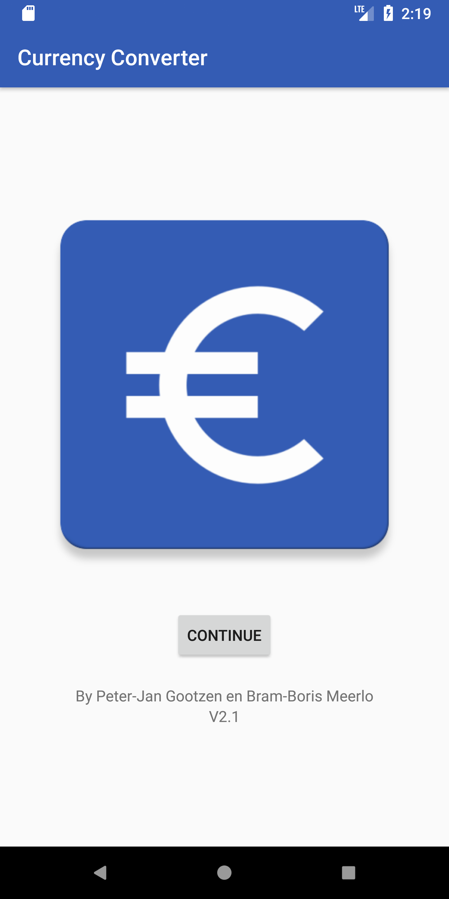
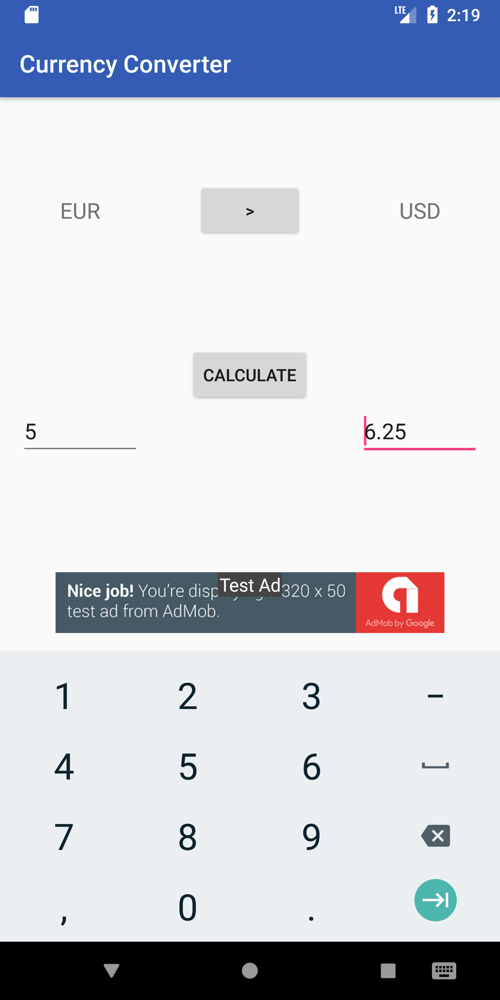

# CurrencyConverter
CurrencyConverter is a simple and lightweight Android app that uses minimal data bandwith to convert currencies.
This project is completely FOSS. The rates are requested from the [fixer.io](https://http://fixer.io/) api that pulls it's data from European Central Bank.

We will put this project on the Play Store when it is finalized. We do not have an ETA for when we are going to continue working on the app.
We have also not decided yet whether or not we are gonna put ads in the Play Store version. They will not be intrusive, that is for sure!

# Features
 - Real-time rates
 - Simple
 - Lightweight
 - Minimal data bandwith usage
 - FOSS
 
# Screenshots
 . . . . . . . 

# Building and installation
```
git clone https://github.com/Peter-JanGootzen/CurrencyConverter.git
Compile the project in Android Studio
Install the .apk on your Android device.
```
